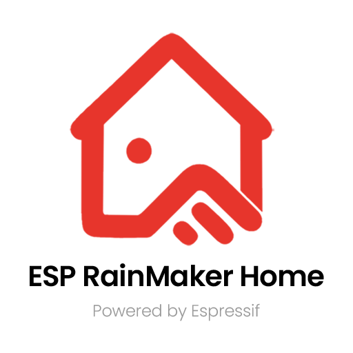

# ESP RainMaker Home App

<div align="center">
<p align="center">
  
</p>
</div>

<div align="center">

[](https://opensource.org/licenses/Apache-2.0)
[](https://reactnative.dev/)
[](https://expo.dev/)

</div>

<div align="center">
<p align="center">
  A powerful React Native application built with Expo for managing your ESP RainMaker IoT ecosystem. 
  Control your smart devices, manage rooms, and automate your home with ease.
</p>
</div>


## ⚡ Quick Start

> If you already have a React Native development environment set up with Node.js 22+, Android Studio/Xcode configured, you can jump straight into the Quick Start section below. For starting from scratch, refer to our detailed [Environment Setup](#environment-setup) section.

**TL;DR - Get running in 5 minutes:**

```bash
# Prerequisites: Node.js 22+, Android Studio or Xcode
git clone https://github.com/espressif/esp-rainmaker-home.git
cd esp-rainmaker-home
nvm use 22
npm install

# Configure environment
cp .env.example .env
# Edit .env if needed, then sync to native projects
npm run prebuild

# Development Build

# For Android
npm run android

# For iOS (macOS only)
npm run ios -- --device
```

## Key Features

- Device Provisioning via QR code, BLE, and SoftAP
- Matter Device Commissioning
- Home & Room Management
- Local and Cloud Device Control
- Authentication with AWS Cognito and OAuth (Google, Apple)
- Real-time Device State Sync
- Scenes, Schedules, and Automations
- AI Agent for natural language device control
- Push Notifications
- Cross-platform (iOS and Android)
- Localization (English, Chinese)
- Feature Flags via environment variables
- UI Test Automation with Appium and Pytest-BDD ([test/README.md](test/README.md))

## 🚀 Getting Started

### Prerequisites

Before you begin, ensure you have the following installed:

- **Node.js**: Version **22**
- **npm** (Node Package Manager)
- **NVM** (Node Version Manager) - Recommended for managing Node.js versions
- A properly configured **React Native development environment**
- **Android Studio** (for Android development)
- **Xcode** (for iOS development on macOS)

> ⚠️ **Important**: This project uses a **development build** and does **not** rely on EAS Build.

#### Node.js Installation

You have two options for installing Node.js:

**Option 1: Using NVM (Recommended)**

NVM allows you to manage multiple Node.js versions easily. Follow the installation guide at:

- 📥 **[NVM Official Repository](https://github.com/nvm-sh/nvm)**

After installing NVM, install Node.js 22:

```bash
nvm install 22
nvm use 22
node --version  # Should show v22.x.x
```

**Option 2: Direct Installation**

Install Node.js directly from the official website:

- 📥 **[Node.js Official Website](https://nodejs.org/)**
- Download **Node.js 22 LTS**
- Verify installation: `node --version` (should show v22.x.x)

### Environment Setup

---

#### Android Setup

To configure your environment for building and running the app on Android using Android Studio:

👉 **[Expo Environment Setup for Android](https://docs.expo.dev/get-started/set-up-your-environment/?mode=development-build&buildEnv=local&platform=android&device=physical)**

**Key Requirements:**

- Install Android Studio with the Android SDK
- Set up Android SDK Build-Tools and Platform-Tools
- Configure Android Virtual Device (AVD) or connect a physical device
- Enable USB Debugging on your Android device

> ⚠️ **Important:** Before syncing Gradle in Android Studio, ensure that the JDK in use is **Zulu JDK 17**.  
> To verify or update this, navigate to:  
> `Tools > SDK Manager > Build, Execution, Deployment > Gradle` and check the JDK path.

If you encounter build issues, try deleting the `./gradle` folders from both your user directory and the project's Android directory.

---

#### Firebase Configuration (`google-services.json`)

Android push notifications require a valid **Firebase** configuration file.

The repository ships a placeholder at `android/app/google-services.json.template`. You must replace `android/app/google-services.json` with your own project's file before building:

1. Go to the [Firebase Console](https://console.firebase.google.com/) and open (or create) your project.
2. Navigate to **Project Settings → Your apps → Android app**.
3. Download `google-services.json`.
4. Copy it to `android/app/google-services.json`, replacing the existing placeholder.

> ⚠️ **Without a valid `google-services.json`, Android push notifications will not work.** The app will build and run, but no notifications will be delivered.

---

#### iOS Setup

To set up your environment for building and running the app from Xcode (macOS only):

👉 **[Expo Environment Setup for iOS](https://docs.expo.dev/get-started/set-up-your-environment/?mode=development-build&buildEnv=local&platform=ios&device=physical)**

**Key Requirements:**

- Install Xcode from the Mac App Store
- Install Xcode Command Line Tools: `xcode-select --install`
- Install CocoaPods: `sudo gem install cocoapods`
- Configure iOS Simulator or connect a physical iOS device

### Installation

1. **Use the correct Node version and clone the repository**
  ```bash
   # Use Node.js 22
   nvm use 22

   # Clone the repository
   git clone https://github.com/espressif/esp-rainmaker-home.git
   cd esp-rainmaker-home
  ```
2. **Install Dependencies**
  ```bash
   npm install
  ```

### Configuration & Customization

The app is highly configurable and customizable. For detailed configuration instructions, please see:

📖 **[Configuration & Customization Guide](./docs/CONFIGURATION.md)**

This guide covers:

- SDK configuration and setup
- Device and parameter customization
- Theme and UI customization
- Localization and internationalization
- Advanced customization options
- API endpoint configuration

### Running the App

Before running the app, set up your environment variables and sync them to the native projects:

1. Copy the example env file:
  ```bash
   cp .env.example .env
  ```
   Open `.env` and update the values as needed. The defaults work out of the box for the public ESP RainMaker deployment.
2. Sync env variables to native projects:
  ```bash
   npm run prebuild
  ```
   This runs `scripts/sync-env-to-android.js` and `scripts/sync-env-to-ios.js` to inject the env values into the Android and iOS native build config. Re-run this whenever you change `.env`.
  > Note: `npm run android` and `npm run ios` call their respective prebuild steps automatically. You only need to run `npm run prebuild` manually when preparing a production build or after changing `.env` without running the app.

#### Android

To run the app on a connected Android device or emulator:

```bash
npm run android
```

> **Note:** Ensure you have replaced `android/app/google-services.json` with your own Firebase project's file. Without it, push notifications will not work. See [Firebase Configuration](#firebase-configuration-google-servicesjson) for details.

#### iOS

To run the app on a connected iOS device or simulator:

```bash
npm run ios
```

#### Development Server

To start the development server:

```bash
npm start
```

### Building for Production

#### Android Release Build

```bash
npx react-native run-android --mode release
```

This command properly bundles the JavaScript code and builds a complete release APK. The APK will be available at `android/app/build/outputs/apk/release/app-release.apk`

> **Note:** Using `./gradlew assembleRelease` directly may result in a white screen because it doesn't bundle the JavaScript code required for the app to run.

#### iOS Release Build

1. Install iOS dependencies:
  ```bash
   cd ios
   pod install
  ```
2. Open the workspace in Xcode:
  ```bash
   open APP.xcworkspace
  ```
3. In Xcode:
  - Select the "APP" scheme
  - Select your target device or "Any iOS Device"
  - Build and archive the app (Product → Archive)

### Supports

- **iOS**: Version **16.6** or greater (required for Matter support)
- **Xcode**: Version **16.3** and above
- **Android Studio**: Narwhal | 2025.1.1 Patch 1
- **Android**: Version **9** & higher

## 🏗️ Project Architecture

The project follows a **feature-sliced design (FSD)** pattern, where each product feature is a self-contained module. All application code lives under `src/` and is organized into well-defined layers.

### Directory Structure

```
esp-rainmaker-home/
├── app/                          # Expo Router file-based routes
│   ├── _layout.tsx               # Root layout — bootstraps app, mounts context providers
│   ├── index.tsx                 # Entry point / redirect
│   ├── (agent)/                  # AI Agent screens
│   ├── (auth)/                   # Authentication screens
│   ├── (automation)/             # Automation screens
│   ├── (config)/                 # Runtime config scan screen
│   ├── (control)/                # Device control & chart screens
│   ├── (group)/                  # Home / Room management screens
│   ├── (matter)/                 # Matter commissioning screens
│   ├── (provision)/              # Device provisioning screens
│   ├── (scene)/                  # Scene management screens
│   ├── (schedule)/               # Schedule management screens
│   └── (user)/                   # User profile & settings screens
│
├── config/                       # App-level configuration (compile-time & runtime)
│   ├── agent.config.ts           # AI Agent API URLs
│   ├── devices.config.ts         # Device type definitions & icon mappings
│   ├── features.config.ts        # Feature flag resolver (two-level gating)
│   ├── params.config.ts          # Parameter UI control mappings
│   ├── runtime.config.ts         # Runtime config manager (QR-scan based)
│   ├── runtime.keys.config.ts    # Storage keys for runtime config
│   └── sdk.config.ts             # SDK selection, RM/Matter SDK config, feature map
│
├── src/
│   ├── bootstrap/                # App bootstrap (MobX, i18n, headless tasks)
│   ├── assets/                   # Fonts, images, device icons
│   ├── context/                  # React context providers (store, scenes, schedules…)
│   ├── features/                 # Feature modules (FSD)
│   │   ├── agent/                # AI Agent chat feature
│   │   ├── auth/                 # Authentication feature
│   │   ├── automation/           # Automations feature
│   │   ├── config/               # Runtime config scan feature
│   │   ├── control/              # Device control & time-series charts
│   │   ├── group/                # Homes & Rooms management
│   │   ├── matter/               # Matter commissioning
│   │   ├── provision/            # Device provisioning (BLE, SoftAP, QR)
│   │   ├── scene/                # Scenes feature
│   │   ├── schedule/             # Schedules feature
│   │   └── user/                 # User profile & account management
│   ├── integrations/             # CDF Bootstrap & SDK adaptor registration
│   ├── native-adaptors/          # Bridge between RN and native modules
│   │   ├── implementations/      # Concrete adaptor implementations
│   │   └── interfaces/           # TypeScript interfaces for each adaptor
│   ├── proto-ts/                 # Protobuf TypeScript definitions
│   ├── sdk-adaptors/             # CDF SDK adaptor implementations
│   │   └── ESPRMBase/            # ESP RainMaker Base SDK adaptor + transformers
│   ├── shared/                   # Cross-feature shared code
│   │   ├── components/           # Reusable UI components & param controls
│   │   ├── hooks/                # Shared hooks (CDF, debounce, toast…)
│   │   ├── theme/                # Design tokens, global stylesheets
│   │   └── utils/                # Common utilities
│   ├── store/                    # CDF data layer
│   │   ├── entities/             # CDF entity definitions (ESPCDFUser, ESPCDFDevice…)
│   │   ├── errors/               # Typed error classes
│   │   ├── registry.ts           # SDK adaptor registry
│   │   ├── services/             # Node event handlers
│   │   ├── store/                # MobX stores per domain + synchronizers
│   │   ├── types/                # Store & entity type definitions
│   │   └── utils/                # Store utilities
│   ├── tasks/                    # Headless background tasks (Matter, notifications)
│   └── types/                    # Global TypeScript declarations
│
├── locales/                      # i18n translation files
│   ├── en.json                   # English
│   └── zh.json                   # Chinese
│
├── scripts/                      # Build utility scripts
│   ├── sync-env-to-android.js    # Sync .env values into Android build config
│   └── sync-env-to-ios.js        # Sync .env values into iOS build config
│
├── docs/                         # Project documentation
├── test/                         # Appium UI test suite
├── app.config.ts                 # Expo app configuration & env variable injection
├── i18n.ts                       # i18n initialization
└── tsconfig.json                 # TypeScript config with path aliases
```

### Feature Module Structure

Each feature under `src/features/` follows a consistent internal structure:

```
src/features/<feature>/
├── components/    # UI components scoped to this feature
├── hooks/         # Custom hooks for this feature
├── screens/       # Full-page screen components
├── utils/         # Feature-specific helpers and utilities
├── theme/         # Feature-specific stylesheets (optional)
└── index.ts       # Public barrel export
```

Screens in `app/` are thin wrappers — they import and render the screen component from the corresponding `src/features/<feature>/screens/` module, keeping routing concerns separate from feature logic.

### CDF & SDK Adaptor Architecture

The app is built on top of the **ESP Common Data Framework (CDF)**, a platform-agnostic data layer that abstracts all SDK-specific operations.

```
┌──────────────────────────────────────────────────────┐
│                   React UI (features/)               │
├──────────────────────────────────────────────────────┤
│              CDF Store (src/store/)                  │
│  MobX stores · Entities · Synchronizers · Registry  │
├──────────────────────────────────────────────────────┤
│           SDK Adaptor (src/sdk-adaptors/)            │
│         ESPRMBaseSDKAdaptor + Transformers           │
├──────────────────────────────────────────────────────┤
│        ESP RainMaker Base SDK / Matter SDK           │
├──────────────────────────────────────────────────────┤
│        Native Adaptors (src/native-adaptors/)        │
│  Prov · LocalControl · Discovery · OAuth · Matter…  │
└──────────────────────────────────────────────────────┘
```

**CDF Bootstrap** (`src/integrations/index.ts`) runs once at app startup:

1. Loads persisted runtime config from storage.
2. Registers all SDK adaptors with the `AdaptorRegistry`.
3. Initializes the CDF runtime (`initCDF`).
4. Configures the Matter SDK as a standalone side-effect.

To add a new SDK integration, create a new adaptor, register it in `AdaptorFactory`, and add its feature capabilities to `SDK_FEATURE_MAP` in `config/sdk.config.ts`.

### Path Aliases

The project uses TypeScript path aliases (configured in `tsconfig.json`) for clean imports:


| Alias                | Resolves to               |
| -------------------- | ------------------------- |
| `@/`*                | `./*` (project root)      |
| `@src/*`             | `./src/*`                 |
| `@features/*`        | `./src/features/*`        |
| `@shared/*`          | `./src/shared/*`          |
| `@store`             | `./src/store`             |
| `@native-adaptors/*` | `./src/native-adaptors/*` |
| `@sdk-adaptors/*`    | `./src/sdk-adaptors/*`    |
| `@context/*`         | `./src/context/*`         |
| `@config/*`          | `./config/*`              |
| `@assets/*`          | `./src/assets/*`          |
| `@integrations`      | `./src/integrations`      |


## ⚙️ Feature Flags

Features can be enabled or disabled through a **two-level gating** system:

- **Level 2 — SDK capability** (hard gate): defined per SDK in `SDK_FEATURE_MAP` inside `config/sdk.config.ts`. If the active SDK does not support a feature, it is disabled regardless of environment settings.
- **Level 1 — Environment switch** (soft gate): can only *disable* a feature that the SDK supports. Set via `.env` file (see `.env.example`).


| Feature                  | Environment Variable      | Default |
| ------------------------ | ------------------------- | ------- |
| Scenes                   | `ENABLE_SCENES`           | `true`  |
| Schedules                | `ENABLE_SCHEDULES`        | `true`  |
| Automations              | `ENABLE_AUTOMATIONS`      | `true`  |
| Local Control            | `ENABLE_LOCAL_CONTROL`    | `true`  |
| Push Notifications       | `ENABLE_NOTIFICATIONS`    | `true`  |
| Group Sharing            | `ENABLE_GROUP_SHARING`    | `true`  |
| OTA Updates              | `ENABLE_OTA`              | `true`  |
| AI Agent                 | `ENABLE_AI_AGENT`         | `true`  |
| Third-Party Auth (OAuth) | `ENABLE_THIRD_PARTY_AUTH` | `true`  |
| Voice Assistants         | `ENABLE_VOICE_ASSISTANTS` | `true`  |
| CDF Auto-sync            | `ENABLE_CDF_AUTOSYNC`     | `true`  |


The resolved feature state is read at call-time via `getFeatures()` from `config/features.config.ts`, making it safe for runtime SDK switching.

## 🔧 Runtime Configuration

The app supports **QR-code-based runtime configuration**, which lets you point the app at a different backend without a new build.

- Scan a configuration QR code from the `(config)/ConfigScan` screen.
- The scanned payload is validated and persisted via `RuntimeConfigManager` (`config/runtime.config.ts`).
- On the next app launch, persisted values override the compile-time defaults for `baseUrl`, `version`, `authUrl`, and OAuth credentials.
- To configure a new backend, tap the app logo **10 times** on the login screen. This opens the config screen where the existing configuration can be reviewed or updated by scanning a new QR code.

## 🔌 Native Modules & Adapters

The app includes several native modules and adapters that provide platform-specific functionality:

### Platform (iOS/Android) Specific Native Modules

- **ESPDiscoveryModule** - Device discovery via mDNS
- **ESPLocalControlModule** - Local control functionality
- **ESPNotificationModule** - Push notification handling
- **ESPOauthModule** - OAuth integration
- **ESPProvModule** - Provisioning capabilities
- **ESPAppUtilityModule** - Utility functions and permissions
- **ESPMatterModule** - Matter device commissioning and ecosystem integration
- **ESPMatterUtilityModule** - Matter utility functions for certificate management and pre-commissioning storage

### TypeScript Native Adapters

Located in `src/native-adaptors/implementations/`, these provide the bridge between React Native and native module functionality:

- `ESPAppUtilityAdapter.ts`
- `ESPAsyncStorage.ts`
- `ESPDiscoveryAdapter.ts`
- `ESPLocalControlAdapter.ts`
- `ESPMatterAdapter.ts`
- `ESPMatterUtilityAdapter.ts`
- `ESPNotificationAdapter.ts`
- `ESPOauthAdapter.ts`
- `ESPProvAdapter.ts`
- `ESPSoftAPAdapter.ts`

Each adapter has a corresponding TypeScript interface in `src/native-adaptors/interfaces/`.

## 🌐 Localization

The app supports multiple languages via `i18n.ts` and translation files in `locales/`:

- `locales/en.json` — English (default)
- `locales/zh.json` — Simplified Chinese

To add a new language, create a new locale file and register it in `i18n.ts`.

### Troubleshooting

For comprehensive troubleshooting guidance, please see:

🔧 **[Troubleshooting Guide](./docs/TROUBLESHOOTING.md)**

This guide includes solutions for:

- General build and dependency issues
- iOS-specific problems and fixes
- Android-specific issues and solutions
- Development build troubleshooting
- Network and connectivity problems

## 📚 Documentation

### Project Documentation

- 📖 **[Configuration & Customization Guide](./docs/CONFIGURATION.md)** - Detailed guide on configuring and customizing the app
- 🔧 **[Troubleshooting Guide](./docs/TROUBLESHOOTING.md)** - Solutions to common issues and problems

### SDK Documentation

- [ESP RainMaker SDK API Documentation](https://espressif.github.io/esp-rainmaker-app-sdk-ts/)
- [ESP RainMaker Matter SDK API Documentation](https://espressif.github.io/esp-rainmaker-matter-app-sdk-ts/)
- [SDK GitHub Repository](https://github.com/espressif/esp-rainmaker-app-sdk-ts)
- [Matter SDK GitHub Repository](https://github.com/espressif/esp-rainmaker-matter-app-sdk-ts)

## License

This project is licensed under the Apache 2.0 license - see the [LICENSE](LICENSE) file for details.

---

> **⚠️ IMPORTANT NOTICE**: The AWS public deployment details provided in this repository are intended for **development and educational purposes only** and should **NOT be used for commercial purposes**.

